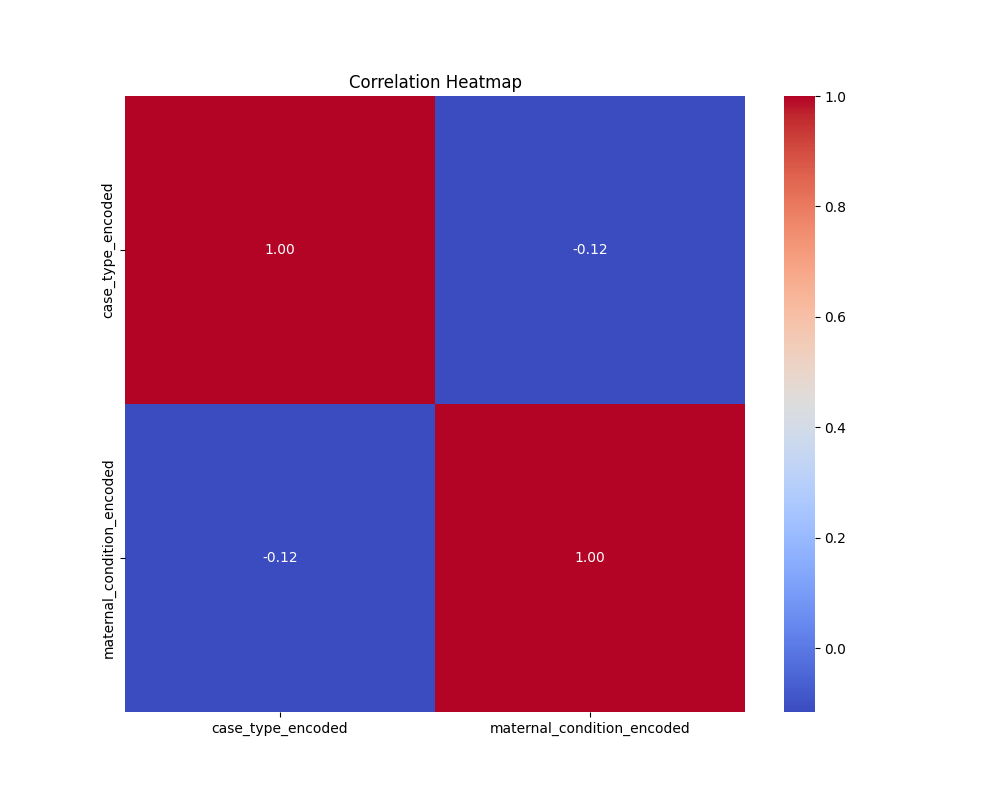
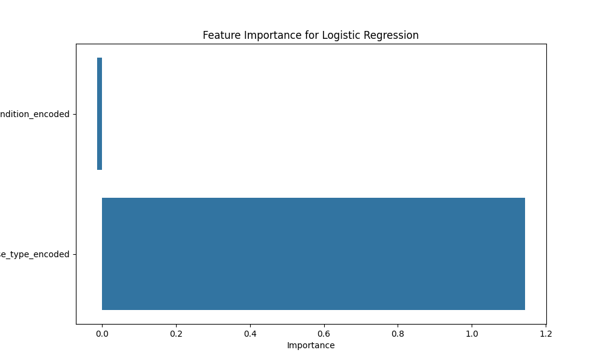
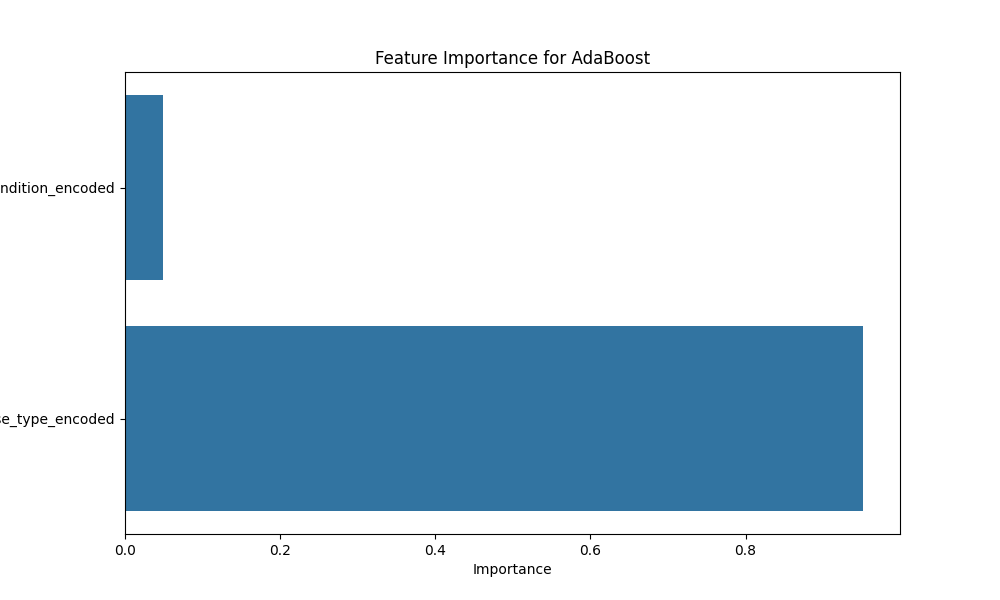
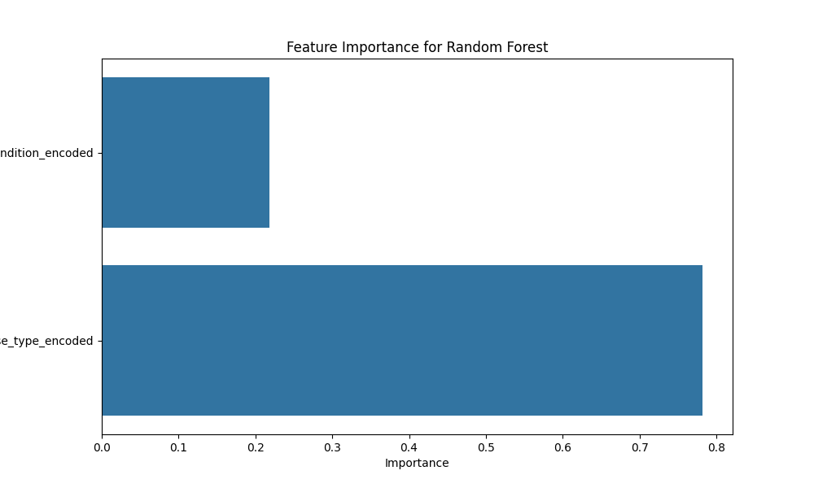
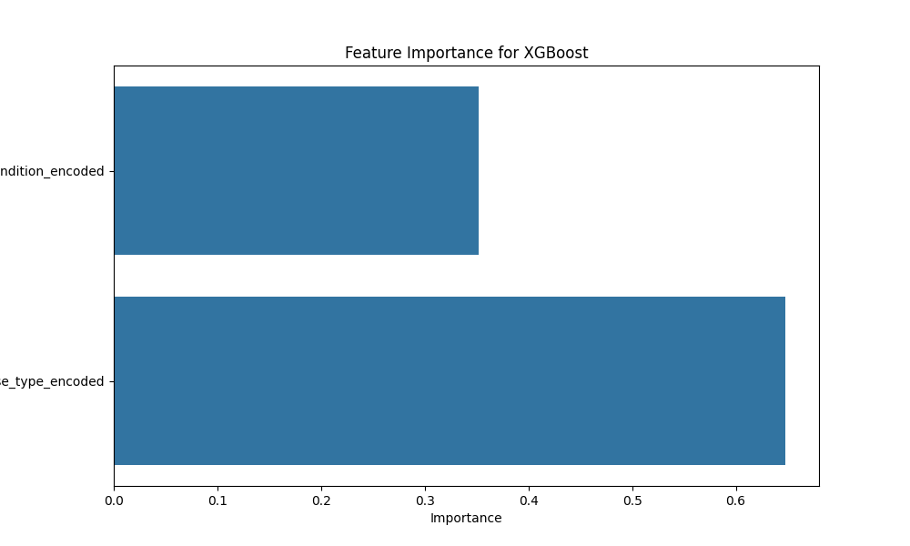
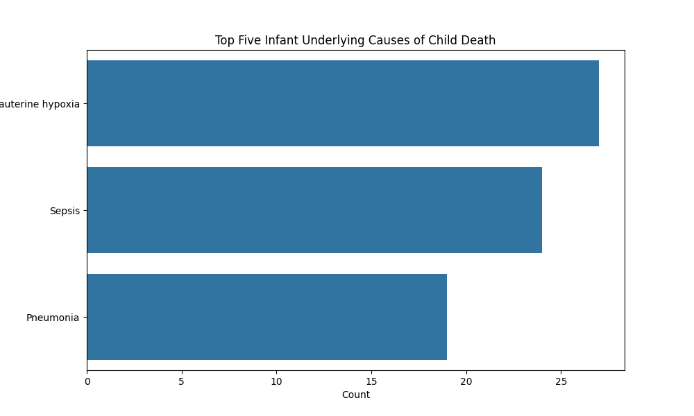
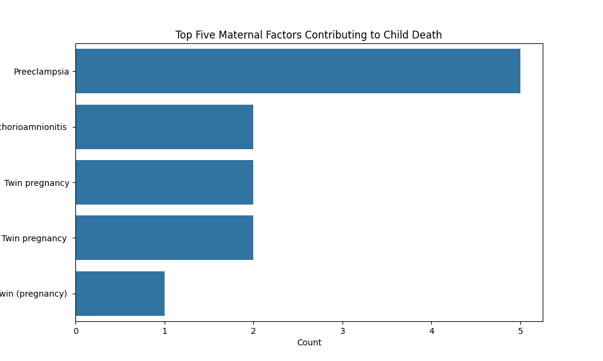
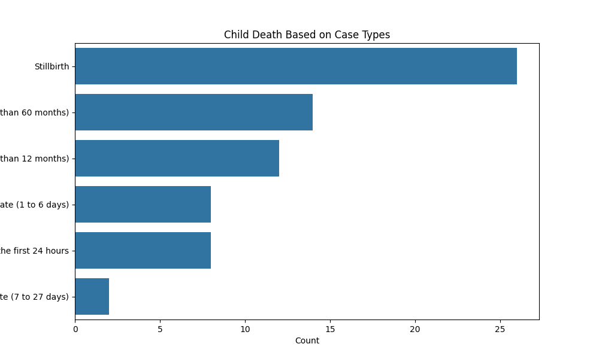
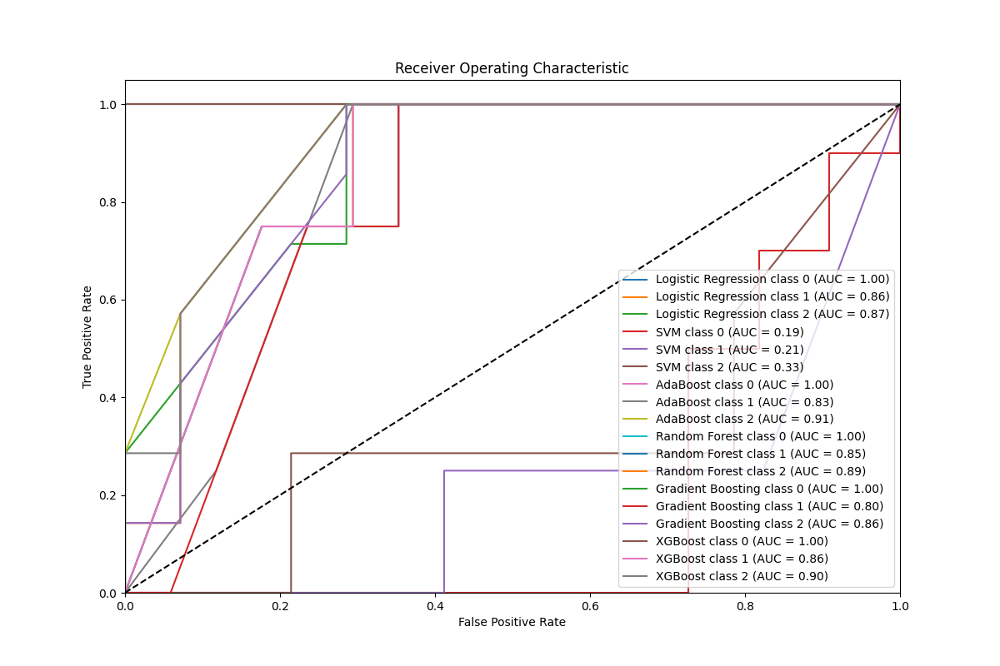
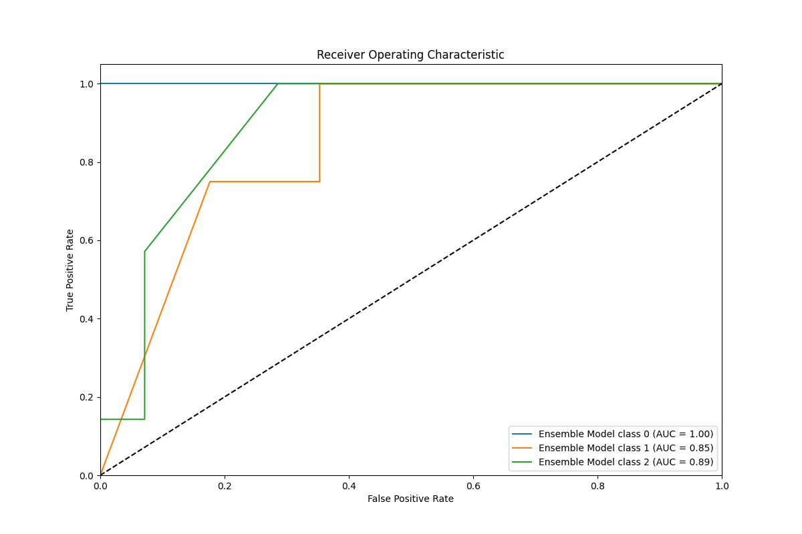

# Child Mortality Analysis

analysis of child mortality data from the CHAMPS dataset.

## Dataset

The dataset used in this project is the `CHAMPS.csv` file, which contains information about child mortality, including underlying causes and maternal conditions.

## Files

- `analysis.py`: This script performs the following tasks:
  - Loads and preprocesses the dataset
  - Performs exploratory data analysis (EDA)
  - Computes descriptive statistics
  - Conducts correlation analysis
  - Trains a logistic regression model
  - Visualizes the results

##  Dependencies
        - pandas
        - seaborn
        - scikit-learn
        - matplotlib
        - xgboost
    
## Results

### Exploratory Data Analysis



### Feature Importance

- Logistic Regression:
  
  
- AdaBoost:
  
  
- Random Forest:
  
  
- Gradient Boosting:
  

- XGBoost:
  
  
### Top Five Infant Underlying Causes of Child Death



### Top Five Maternal Factors Contributing to Child Death



### Child Death Based on Case Types



### Model Evaluation

- AUC:
  

- ROC:
  


## Usage

1. **Clone the repository**:
   ```bash
   git clone https://github.com/zbluee/EPHI_data_challenge
   cd  EPHI_data_challenge 
2. **install the Dependencies**:
```pip install pandas seaborn scikit-learn matplotlib xgboost```